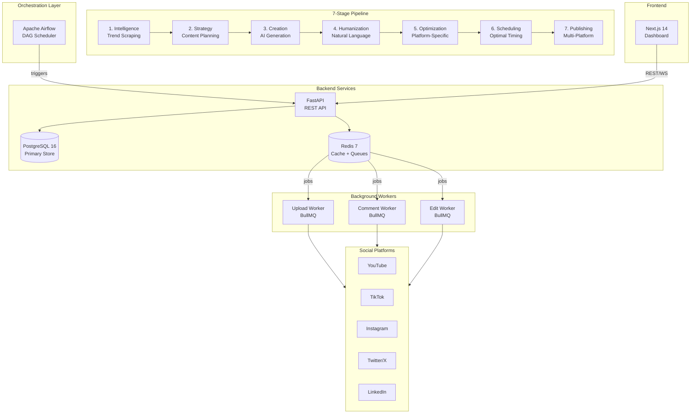

# PublishOps

**AI-Powered Content Automation Platform**

PublishOps is a 7-stage content automation platform that uses AI to discover trends, generate optimized content, and publish across 5 social media platforms — YouTube, TikTok, Instagram, Twitter/X, and LinkedIn.

## Architecture



## Prerequisites

| Tool | Version | Purpose |
|------|---------|---------|
| Docker | 24+ | Container runtime |
| Docker Compose | v2.20+ | Multi-service orchestration |
| Node.js | 20+ | BullMQ workers (local dev) |
| Python | 3.12+ | Backend, Airflow DAGs, seed scripts |
| Git | 2.40+ | Version control |

## Quick Start

### 1. Clone and Configure

```bash
git clone https://github.com/your-org/publishops.git
cd publishops
cp .env.example .env
# Edit .env with your API keys and credentials
```

### 2. Start All Services

```bash
# Automated setup (Linux/macOS)
chmod +x infra/scripts/setup.sh
./infra/scripts/setup.sh

# Manual setup (any OS)
docker compose up -d --build
```

### 3. Access Services

| Service | URL | Credentials |
|---------|-----|-------------|
| Dashboard | http://localhost:3000 | — |
| Backend API | http://localhost:8000 | — |
| API Docs (Swagger) | http://localhost:8000/docs | — |
| Airflow | http://localhost:8080 | admin / admin |
| PostgreSQL | localhost:5432 | publishops / (see .env) |
| Redis | localhost:6379 | — |

### 4. Seed Data

```bash
pip install psycopg2-binary
python infra/scripts/seed_hooks.py
python infra/scripts/seed_platform_rules.py
```

## Environment Setup

Copy `.env.example` to `.env` and configure:

```bash
cp .env.example .env
```

**Required for basic operation:**
- `POSTGRES_PASSWORD` — Change from default
- `SECRET_KEY` — Generate with `openssl rand -hex 32`
- `AIRFLOW__CORE__FERNET_KEY` — Generate with `python -c "from cryptography.fernet import Fernet; print(Fernet.generate_key().decode())"`

**Required for content generation:**
- `ANTHROPIC_API_KEY` — Primary AI engine (Claude 3.5 Sonnet)
- Platform API keys for each social network you want to publish to

## Project Structure

```
PublishOps/
├── .env.example                # Environment template
├── docker-compose.yml          # Full stack orchestration
├── README.md                   # This file
│
├── airflow/                    # Apache Airflow
│   ├── dags/                   # DAG definitions
│   │   ├── main_pipeline_dag.py    # Master pipeline (every 6h)
│   │   ├── intelligence_dag.py     # Trend scraping (every 2h)
│   │   ├── analytics_dag.py        # Metrics collection (hourly)
│   │   ├── repost_dag.py           # Repost check (daily 2 AM)
│   │   └── weekly_recalc_dag.py    # Window recalc (Monday 3 AM)
│   ├── plugins/                # Airflow plugins
│   └── requirements.txt        # DAG Python dependencies
│
├── backend/                    # FastAPI backend (separate repo/module)
│   ├── app/
│   │   ├── main.py
│   │   └── ...
│   └── requirements.txt
│
├── dashboard/                  # Next.js 14 frontend (separate repo/module)
│   ├── package.json
│   └── ...
│
├── workers/                    # BullMQ background workers
│   ├── package.json
│   └── src/
│       ├── queue_config.js     # Shared configuration
│       ├── upload_worker.js    # Platform upload processor
│       ├── comment_worker.js   # Comment engagement processor
│       └── edit_worker.js      # Post-edit processor
│
├── data/                       # Seed data
│   ├── hooks_library.json      # 55+ content hooks
│   └── platform_rules.json    # Algorithm rules (5 platforms)
│
└── infra/                      # Infrastructure
    ├── docker/                 # Dockerfiles
    │   ├── Dockerfile.backend
    │   ├── Dockerfile.dashboard
    │   ├── Dockerfile.airflow
    │   ├── Dockerfile.worker
    │   └── postgres-init.sh
    ├── scripts/                # Utility scripts
    │   ├── seed_hooks.py
    │   ├── seed_platform_rules.py
    │   └── setup.sh
    └── terraform/              # AWS infrastructure
        ├── main.tf
        ├── variables.tf
        ├── vpc.tf
        ├── ec2.tf
        ├── rds.tf
        ├── elasticache.tf
        ├── s3.tf
        ├── lambda.tf
        └── outputs.tf
```

## API Documentation

The FastAPI backend auto-generates interactive API documentation:

- **Swagger UI**: http://localhost:8000/docs
- **ReDoc**: http://localhost:8000/redoc

### Key Endpoints

| Method | Endpoint | Description |
|--------|----------|-------------|
| `POST` | `/api/v1/pipeline/intelligence` | Trigger trend gathering |
| `POST` | `/api/v1/pipeline/strategy` | Generate content strategy |
| `POST` | `/api/v1/pipeline/create` | Create content via AI |
| `POST` | `/api/v1/pipeline/humanize` | Apply humanization |
| `POST` | `/api/v1/pipeline/optimize` | Platform optimization |
| `POST` | `/api/v1/pipeline/schedule` | Schedule and queue uploads |
| `GET`  | `/api/v1/analytics/dashboard` | Dashboard metrics |
| `POST` | `/api/v1/analytics/collect` | Collect platform metrics |
| `GET`  | `/health` | Health check |

## Airflow DAGs

| DAG | Schedule | Description |
|-----|----------|-------------|
| `main_pipeline` | Every 6 hours | Full 7-stage content pipeline |
| `intelligence` | Every 2 hours | Trend scraping from 10 sources |
| `analytics` | Hourly | Platform metrics collection |
| `repost` | Daily 2 AM | Identify repost-eligible content |
| `weekly_recalc` | Monday 3 AM | Recalculate posting windows |

## Development Guide

### Running Individual Services

```bash
# Backend only
docker compose up -d postgres redis backend

# Workers only
docker compose up -d redis upload-worker comment-worker edit-worker

# Airflow only
docker compose up -d postgres redis airflow-init airflow-webserver airflow-scheduler airflow-worker
```

### Running Workers Locally

```bash
cd workers
npm install
node src/upload_worker.js   # Run upload worker
node src/comment_worker.js  # Run comment worker
node src/edit_worker.js     # Run edit worker
```

### Viewing Logs

```bash
docker compose logs -f backend         # Backend logs
docker compose logs -f upload-worker   # Upload worker logs
docker compose logs -f airflow-scheduler  # Airflow scheduler
docker compose logs --tail=50 --follow    # All services
```

### Database Access

```bash
# Connect to PostgreSQL
docker compose exec postgres psql -U publishops -d publishops

# Connect to Redis
docker compose exec redis redis-cli
```

## Deployment Guide (AWS)

### Prerequisites

1. AWS CLI configured with appropriate credentials
2. Terraform >= 1.7.0 installed
3. S3 bucket for Terraform state (`publishops-terraform-state`)
4. DynamoDB table for state locking (`publishops-terraform-locks`)

### Deploy

```bash
cd infra/terraform

# Initialize Terraform
terraform init

# Review the plan
terraform plan -var-file="prod.tfvars"

# Apply
terraform apply -var-file="prod.tfvars"
```

### Post-Deploy

1. SSH into EC2 instance
2. Clone the repository to `/opt/publishops`
3. Copy Terraform outputs to `.env`
4. Run `docker compose -f docker-compose.yml up -d`
5. Run seed scripts

### Infrastructure Costs (Estimated)

| Resource | Spec | Monthly Cost |
|----------|------|-------------|
| EC2 | t3.medium | ~$30 |
| RDS | db.t3.micro | ~$15 |
| ElastiCache | cache.t3.micro | ~$12 |
| S3 | Variable | ~$3 |
| Lambda | ~2,900 invocations/mo | ~$1 |
| NAT Gateway | Per AZ | ~$32 |
| **Total** | | **~$93/mo** |

## Contributing

1. Fork the repository
2. Create a feature branch: `git checkout -b feature/my-feature`
3. Follow the code style:
   - Python: Ruff formatter, type hints
   - JavaScript: ESLint, ES modules
   - Terraform: `terraform fmt`
4. Write tests for new features
5. Submit a pull request with a clear description

### Commit Convention

```
type(scope): description

feat(pipeline): add TikTok carousel support
fix(worker): handle OAuth token expiry gracefully
infra(terraform): add CloudFront distribution
docs(readme): update deployment guide
```

## License

Proprietary — All rights reserved.
